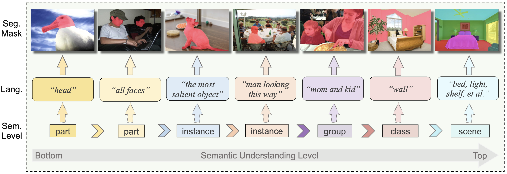
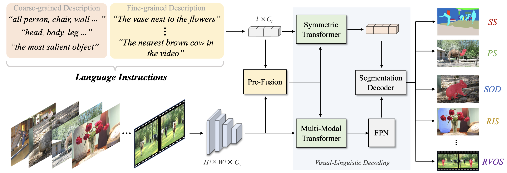
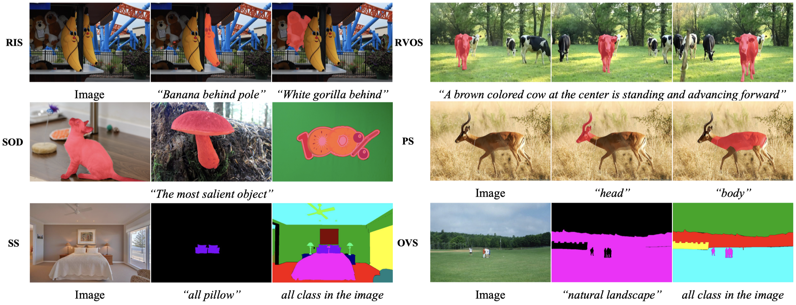
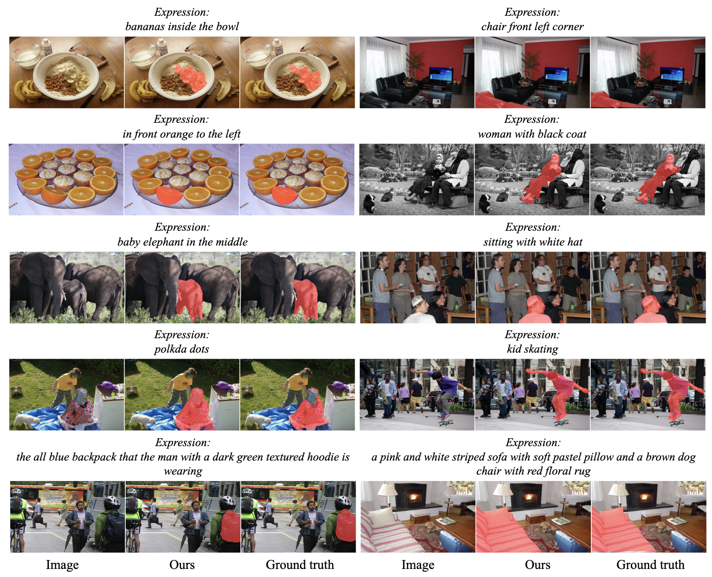

# Universal Segmentation at Arbitrary Granularity with Language Instruction
Yong Liu, Cairong Zhang, Yitong Wang, Jiahao Wang, Yujiu Yang, Yansong Tang

The repository contains the official implementation of "Universal Segmentation at Arbitrary Granularity with Language Instruction"

[Paper](https://arxiv.org/abs/2312.01623)

 

  

  

  
 
   
  

## 📖 Abstract
This paper aims to achieve universal segmentation of arbitrary semantic level.
Despite significant progress in recent years, specialist segmentation approaches are limited to specific tasks and data distribution. Retraining a new model for adaptation to new scenarios or settings takes expensive computation and time cost, which raises the demand for versatile and universal segmentation model that can cater to various granularity. 
Although some attempts have been made for unifying different segmentation tasks or generalization to various scenarios, limitations in the definition of paradigms and input-output spaces make it difficult for them to achieve accurate understanding of content at arbitrary granularity. 
To this end, we present UniLSeg, a universal segmentation model that can perform segmentation at any semantic level with the guidance of language instructions. 
For training UniLSeg, we reorganize a group of tasks from original diverse distributions into a unified data format, where images with texts describing segmentation targets as input and corresponding masks are output. Combined with a automatic annotation engine for utilizing numerous unlabeled data, UniLSeg achieves excellent performance on various tasks and settings, surpassing both specialist and unified segmentation models.

---
## 📖 Pipeline

 

 

## 📖 Visualization

 

 

## 📖 Results

 

## 🎤🎤🎤 Todo

- [ ] Release the code and checkpoint